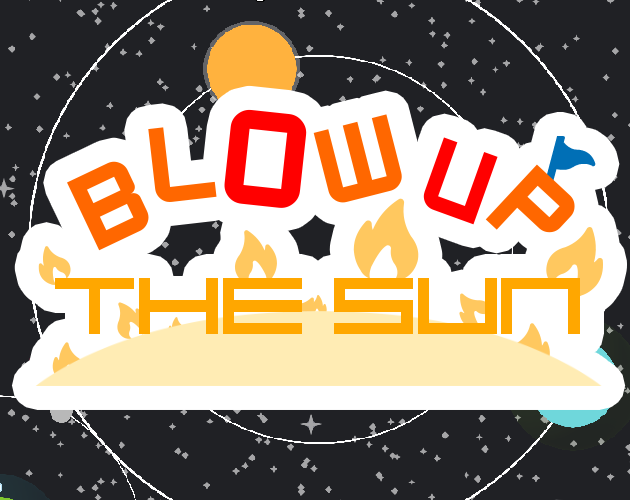
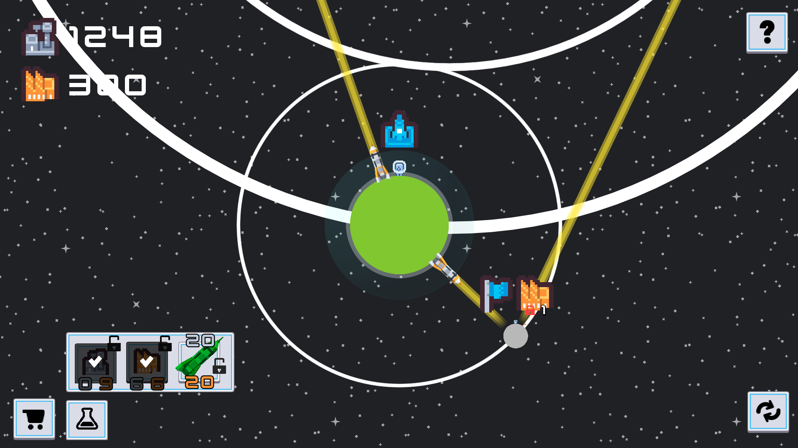
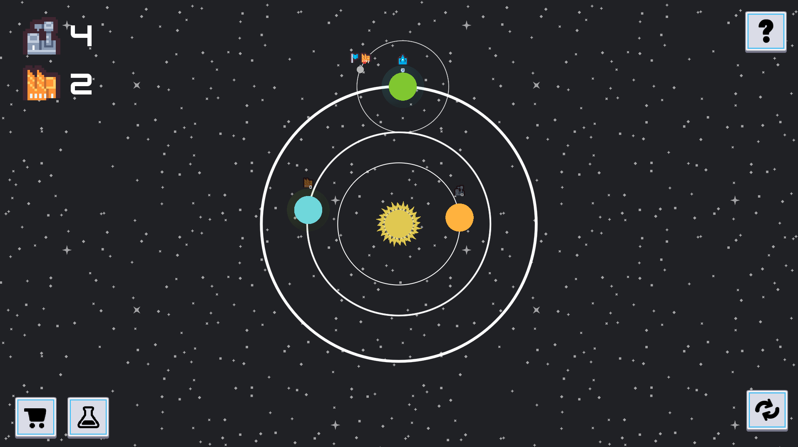
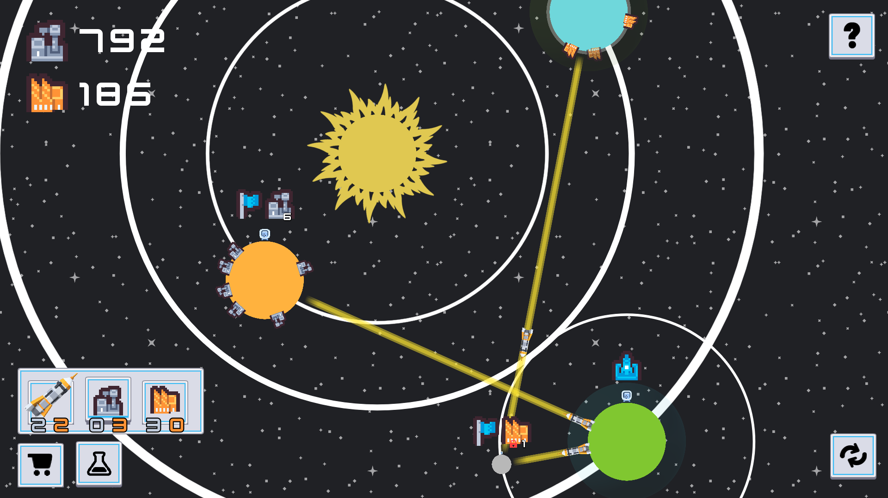

<h1 class="text-center">[Gamejam] Blow Up The Sun</h1>

  

{ align=right width=50% }
{ align=right width=50% }
{ align=right width=50% }
{ align=right width=50% }

<b>Play for free on  :fontawesome-brands-itch-io: [itch.io!](https://joeyehand.itch.io/blow-up-the-sun)</b>

In Blow Up The Sun, the player has to colonize the planets in their solar system to harvest resources, so they can research more technologies and eventually Blow Up The Sun.

Blow Up The Sun was developed for the solo-developer Kenney Jam 2024, within 48 hours. My aim was to create a tech demo for the concept.

Made in :simple-godotengine: Godot using GDScript.

 

