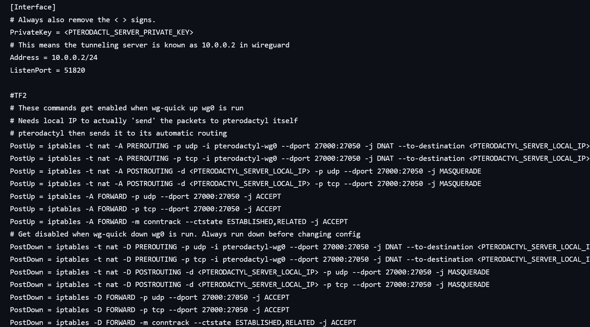

<h1 class="text-center">[Wireguard configs] Game server tunneling</h1>
{ align=right width=50% }
<b>Configs and instructions are available on :material-github: [Github.](https://github.com/Autismobox-TF2/tunneling-wireguard-configs)</b>

My gameserver traffic is tunneled.

This repo contains instructions and config files to tunnel team fortress 2 game traffic. The config files can be expanded to cover other games as well. Just add that game's ports.

Client (tf2 player) -> Tunneling server (VPS) -> Pterodactyl server -> containers (Running game servers, e.g. tf2)

Wireguard is used to tunnel this traffic.
The latency difference with this method depends on how close your proxy is to your production server.

The config files are for :simple-wireguard: Wireguard, written for :simple-linux: Linux' IPTables.