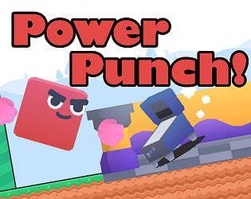
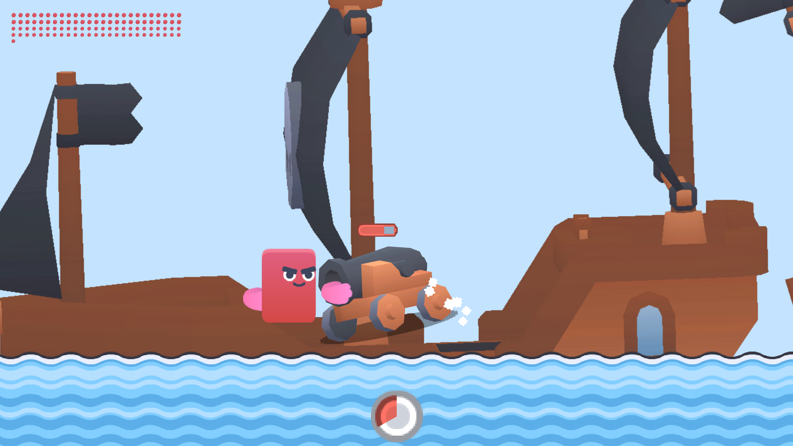
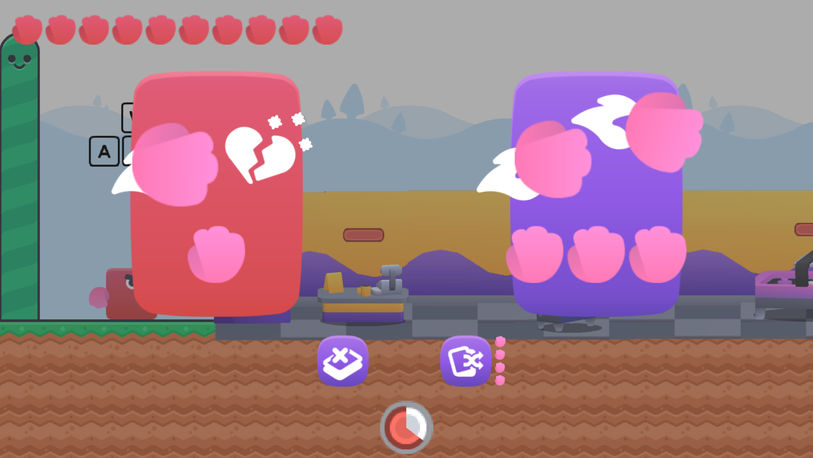
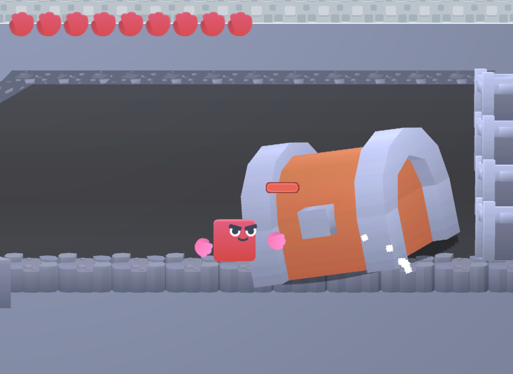
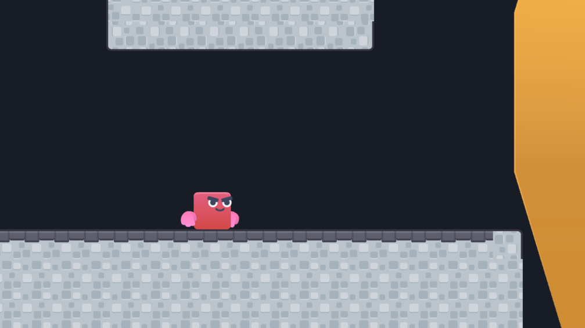

<h1 class="text-center">[Gamejam] Power Punch!</h1>

  

<b>Play for free on  :fontawesome-brands-itch-io: [itch.io!](https://joeyehand.itch.io/power-punch)</b>
{ align=right width=50% }
{ align=right width=50% }
{ align=right width=50% }
{ align=right width=50% }
{ align=right width=50% }

You dream of punching something nobody has ever touched...
Punching things earns you currency. Spend the currency to upgrade your punches & extend your punching time!

Power Punch is an incremental punching game made within 36 hours for the solo-developer Kenney Gamejam 2025

Power Punch has over 300 browser plays on :fontawesome-brands-itch-io: itch.io. Made in :simple-godotengine: Godot using GDScript.
 

