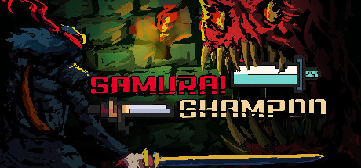
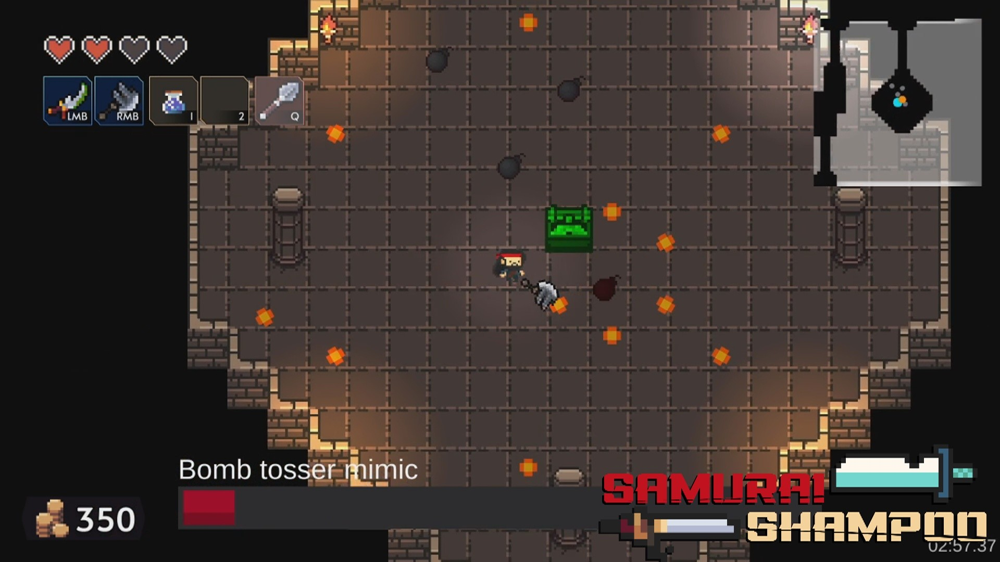
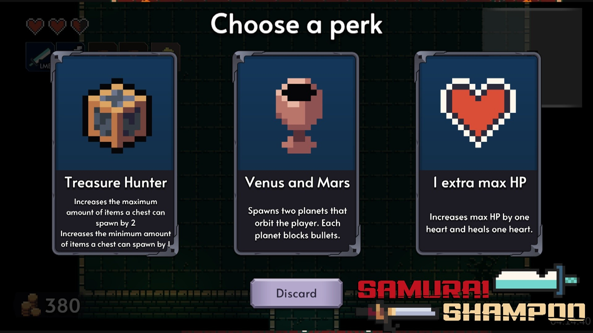
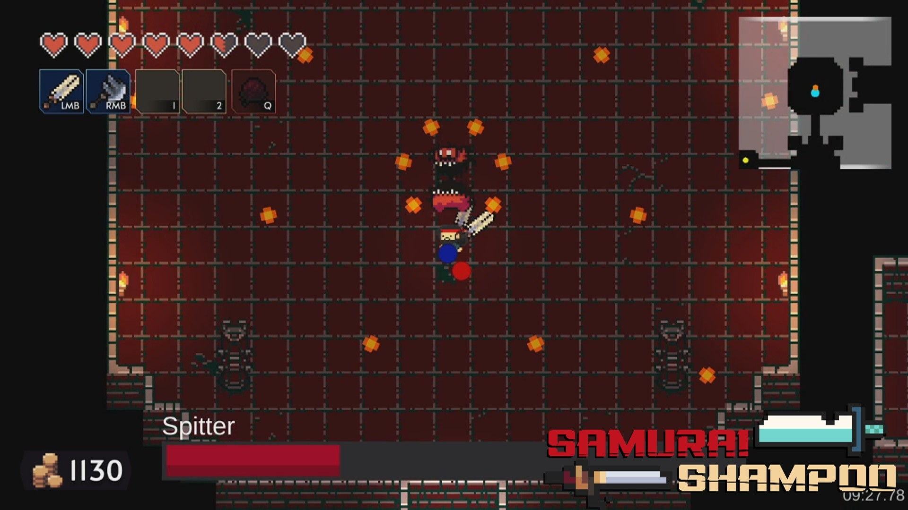
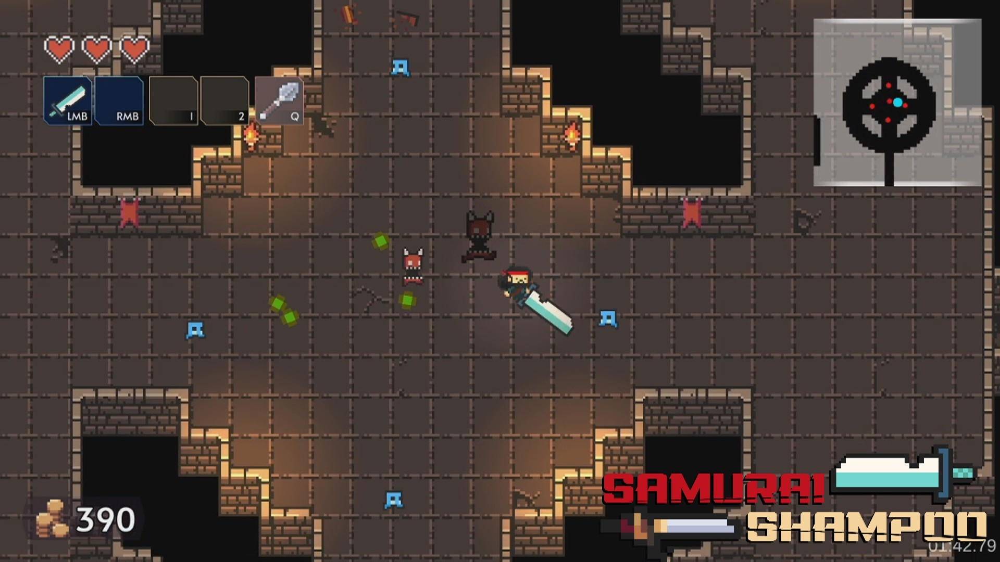

<h1 class="text-center">[Game] Samurai Shampoo</h1>

  

 

{ align=right width=50% }
{ align=right width=50% }
{ align=right width=50% }
{ align=right width=50% }
{ align=right width=50% }

<b>Play for free on  :simple-steam: [Steam!](https://store.steampowered.com/app/1667770)</b>

  Samurai Shampoo is a melee-based roguelike dungeon crawler videogame where a fallen samurai must retrieve his stolen Shampoo. It was awarded second place overall game in the "Winnovation best-overall game" category.

Samurai Shampoo has been played by 20.000 unique players, and has 170 reviews on :simple-steam: steam. On top of that, approval was granted by Nintendo for :material-nintendo-switch: Nintendo Switch development.

Samurai Shampoo was originally created by 6 people in 10 weeks. Since then, I've released one major update with a teammate, and two major updates solo.

  Some of my contributions post-launch:

<ul>
  <li>Redesigned all menus and UI elements to be more polished;</li>
  <li>Set up several playtests and collected player feedback on new systems and features</li>
  <li>Balanced several systems and items (Like 'chest room' spawn rates and potion statistics) as a response to player feedback; </li>
  <li>Developed a playable mobile version of samurai shampoo (unpublished)</li>
  <li>Improved Steam Store page. Improved screenshots and trailer, hired freelancer for capsule(s).</li>
</ul>

  Some of my contributions during the initial development of Samurai Shampoo:

<ul>
  <li>Designed and implemented core systems like; the Entity-Component system, State machines and states, "Health point" system, Sound system, and luck system</li>
  <li>Researched best implementations of UI/UX (User Interface / User Experience, including 'game feel')</li>
  <li>Designed UI/UX and implemented them</li>
  <li>Tested implementations of UI/UX through playtesting</li>
  <li>showed leadership and mediator skills through steering the project when needed, making quick decisions when necessary, and mediate in the project group when needed </li>
  <li>Was pro-active by actively communicating with outsiders (Reviewers, judges, etc) and taking responsibility of multiple parts of the project.</li>
  <li>Designed and published the Steam Store page. </li>
</ul>

Samurai Shampoo was made in :simple-unity: Unity using C#.

